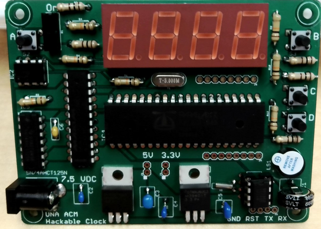
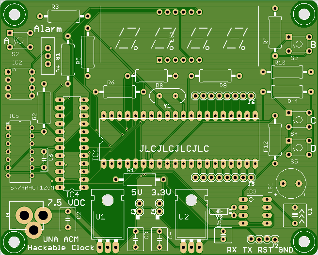
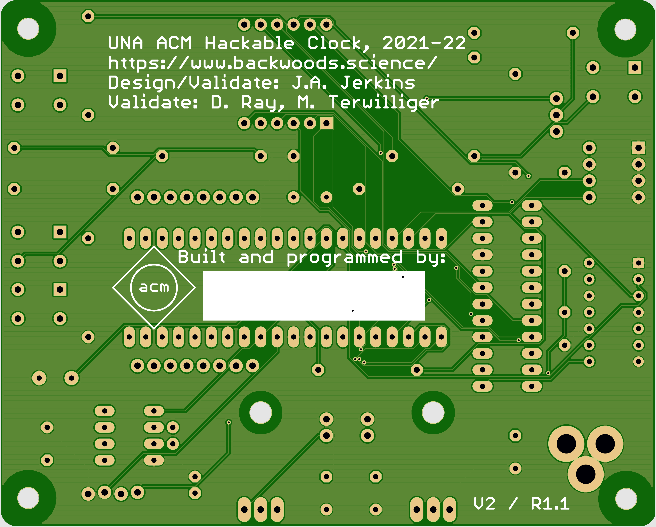

# UNA ACM Hackable Clock V2 Project

## Project Overview

The [University of North Alabama](https://www.una.edu/computing) student chapter of [ACM](https://www.acm.org) co-sponsored the Hackable Clock V2 Project with the Department of Computer Science and Information Systems. Participants in the extracurricular project received a kit containing all of the electronic components, printed circuit board (pcb), and software tools to assemble and program their own digital alarm clock.

The [digital alarm clock kit](https://www.backwoods.science/hack2/) is based on the Parallax Propeller chip and the software is written in C. The clock was conceived to be "hackable". The clock's functionality can be extended using the exposed CPU pins (P8-P23) along with 3.3V and 5V power connectors designed into the pcb (for example: obtain time from GPS, use sound files for the alarm, connect the clock to wireless).

## User Interface Design

The [user interface document](design/interface.md) describes how to manipulate the clock's functions. The clock functions include an alarm, two types of snooze, the date, day of week, and display brightness. All of the clock's functions are accessed using the four buttons and switch.

## Software Design

The software is organized into the following modules:

Module    | Description
----------|------------------------------------------------------------------
clock.c   | Main driver and user interface
common.h  | Common definitions, shared memory variables, and pin assignments
ds1302.h  | Definitions and pin assignments - Timekeeping IC driver
ds1302.c  | Timekeeping IC driver
max7221.h | Definitions and pin assignments - LED display driver
max7221.c | LED display driver
alarm.h   | Definitions and pin assignments - Alarm driver
alarm.c   | Alarm driver

The file _clock.side_ is the project file and contains compiler flags, linker flags, and CPU constants.

## Component Datasheets and Schematic

* [Microcontroller (CPU)](https://www.parallax.com/package/p8x32a-propeller-datasheet/)
* [EEPROM](https://ww1.microchip.com/downloads/en/DeviceDoc/24AA256-24LC256-24FC256-Data-Sheet-20001203W.pdf)
* [Timekeeping chip (RTC)](https://datasheets.maximintegrated.com/en/ds/DS1302.pdf)
* [LED display driver IC](https://datasheets.maximintegrated.com/en/ds/MAX7219-MAX7221.pdf)
* [Clock schematic](design/Hackable_Clock_2_schematic.pdf)

## Printed Circuit Board (PCB)

[PCB layout](design/Hackable_Clock_2_board.pdf)

## Bill of Materials

Schematic ID | Item             | Description
-------------|------------------|----------------
IC1  | P8X32A  | Parallax Propeller 1 (CPU)
IC2  | 24LC256  | 256K I2C serial EEPROM
IC3  | DS1302+  | Timekeeping chip w/ scratchpad RAM (RTC)
IC4  | MAX7221CNG  | Serial interface 8-digit LED display driver
IC5  | SN74AHCT125N  | Quad bus buffer w/ tri-state outputs (level shifter)
DS1  | LTC-5723HR  | 4-digit LED display, red
U1  | LM2940-N  | 5V LDO regulator, 1A
U2  | LM3940  | 3.3V LDO regulator, 1A
J1  | PJ-202A  | DC power jack
J2  | ----  | Programming header, offset, x4
J3  | ----  | 5V header, x2
J4  | ----  | 3.3V header, x2
J5  | ----  | CPU pin header, x8 (P8-P15)
J6  | ----  | CPU pin header, x8 (P16-P23)
S1  | EG-1218  | SPDT slide switch
S2  | 1825910-6  | 6MM tactile switch, thru-hole
S3  | 1825910-6  | 6MM tactile switch, thru-hole
S4  | 1825910-6  | 6MM tactile switch, thru-hole
S5  | 1825910-6  | 6MM tactile switch, thru-hole
LS1  | CMI-9605IC-0380T  | Audio indicator (spkr)
Y1  | HC-49US  | 5 MHz quartz crystal
Y2  | C-002RX32  | 32.768 KHz crystal
C1  | SVLT5R522  | 0.22 F capacitor (RTC backup)
C2  | FG MLCC  | 0.47 uF capacitor
C3  | RDE MLCC  | 22 uF capacitor
C4  | FG MLCC  | 0.47 uF capacitor
C5  | FG MLCC  | 33 uF capacitor
C6  | K MLCC  | 0.1 uF capacitor
R1  | OL10535E-R52  | 10K, 1/2w, 5%, IC1 pull-up
R2  | OL1535E-R52  | 15K, 1/2w, 5%, ISET
R3  | CFR50J100R  | 100, 1/2w, 5%, S1
R4  | OL10535E-R52  | 10K, 1/2w, 5%, S1 pull-down
R5  | CFR50J100R  | 100, 1/2w, 5%, S2
R6  | OL10535E-R52  | 10K, 1/2w, 5%, S2 pull-down
R7  | CFR50J100R  | 100, 1/2w, 5%, S3
R8  | OL10535E-R52  | 10K, 1/2w, 5%, S3 pull-down
R9  | CFR50J100R  | 100, 1/2w, 5%, S4
R10  | OL10535E-R52  | 10K, 1/2w, 5%, S4 pull-down
R11  | CFR50J100R  | 100, 1/2w, 5%, S5
R12  | OL10535E-R52  | 10K, 1/2w, 5%, S5 pull-down

