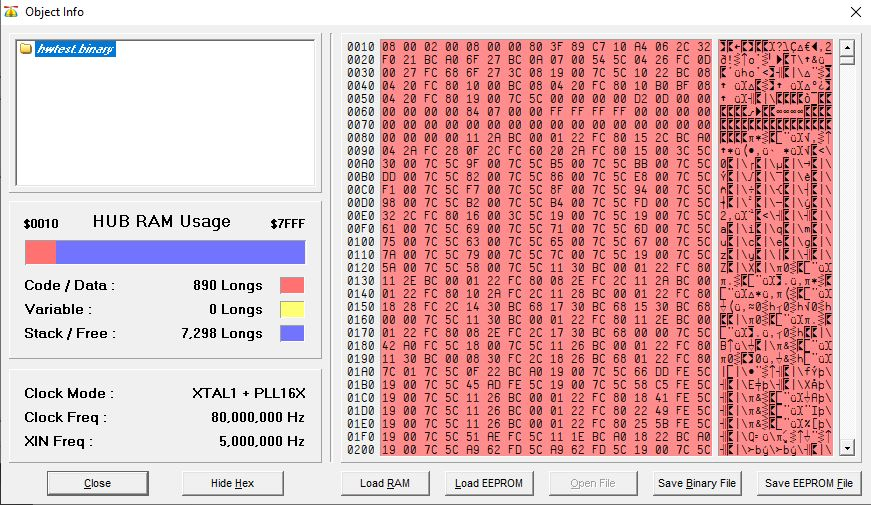

## Install the Clock Hardware Test program

Once your clock is completely assembled you may install the hardware test program to verify your clock hardware is functional. The test program is used to check that all four buttons, the switch, the display, and speaker (indicator) all work. The test program will set the display to _test mode_ and then initialize it (similar to the display driver). Next, the display will show 1234 and enable the buttons and switch. The following functions are used to check your hardware:

* A button - change the left most display character (LED digit 0)
* B button - change the second display character (LED digit 1)
* C button - change the third most display character (LED digit 2)
* D button - change the right most display character (LED digit 3)
* Switch - enable all decimal points on the display and beep

The labs in Keller Hall and Math already have the software you need to upload the test program to your clock. The test program is already compiled into a binary (executable format).

Follow these steps on any lab PC to install the hardware test program:

1.  Obtain a [4-pin section of breakaway header](../images/header.png) from Dr. Jerkins
2.  [Insert the headers into your programmer](../images/programmer.png)
3.  Connect a USB cable to the programmer (USB cable is not included in your kit)
4.  [Connect the programmer](../images/connector.png) to your clock - Match the *RX TX RST VSS* on the clock
5.  Connect the USB cable to the computer
6.  Unpackage your clock's power supply and plug it into power and the clock
7.  Download the [hardware test program](hwtest.binary) to the lab computer
8.  Double-click the *hwtest.binary* file - the SPIN/Upload tool will open ([screenshot](../images/spintool.jpg))
9.  Click the *Load EEPROM* button - you will see LEDs blinking on the programmer and status messages on the lab computer screen as the test program is being uploaded to your clock
10. The hardware test program will automatically run when the upload is done. You may disconnect the programmer after the upload is finished.

